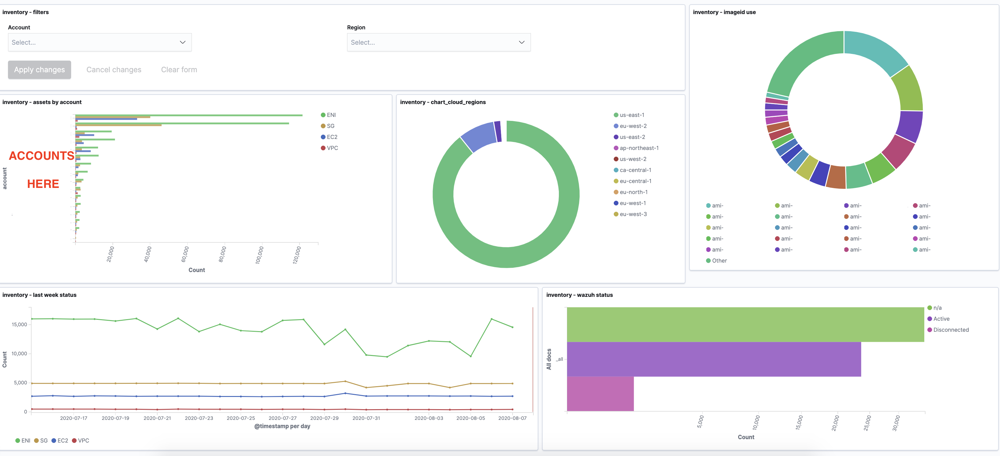
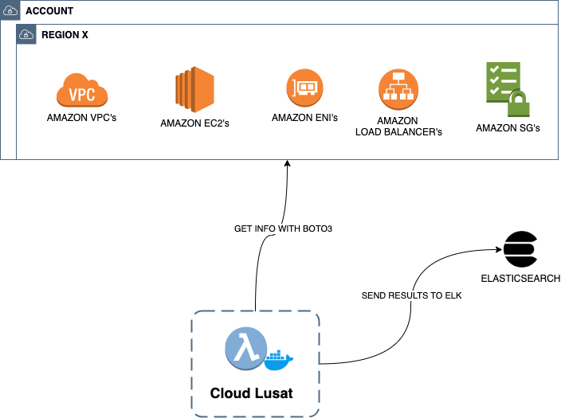

<p align="center">
  
</p>

## *Internal threat intelligence, inventory and compliance data collection*

***Cloud Lusat*** is an open source tool written in python aimed to automate the internal threat intelligence generation, inventory collection and compliance checker for different AWS resources. ***Cloud Lusat*** collects information and saves it into an ElasticSearch index.

The current version runs into docker. The corresponding image has a python script to scrap the configured AWS accounts and regions to get the relevant information.

The system is currently available for *AWS*, but it is to be extended to others cloud platforms.

<div style="text-align:center"></div>

### Main objectives

* Collect and detect internal IOCs from cloud environments.
* Centralize inventory and configuration of cloud resources.


### Cloud Sniper integration

[work in progress] ***Cloud Lusat*** is now part of the ***Cloud Sniper*** solutions family. We are working on integrating it by means of SQS, so that ***Cloud Sniper*** can take the corresponding actions. For instance, ***Cloud Sniper*** may inform users about unused resources or public policies on s3.


### Covered AWS services

***Cloud Lusat*** reports IOCs and inventory for the following AWS services and resources:
* VPC
* EC2
* ENIs
* Security groups
* Load balancers


### Usage

<div style="text-align:center"></div>
<br/>

The current docker image can be configureg with kubernetes, docker or even lambda to be executed periodically. The parameters needed to run it are the account ID, the role and the type of inventory we are interested in: `all`, `ec2`, `eni` or other supported services. The result of such execution is the collection of the corresponding assets.

The docker image starts querying the AWS API using boto3 to get information about the existing resources for that service; and an additional analyzer is triggered to get context information, including: 

* EC2 running time
* Security group rules status: `open` or `close`
* Logging configuration
* AMI ID creation days
* Security groups being uses: `used` or `not in use`
* AMI owner
* AMI name

Each result is stored in the configured ElasticSearch, in a index called: `inventory-XXX`.

To run the docker container, the following arguments are required:

```
docker run --rm \
    -e AWS_ACCESS_KEY_ID \
    -e AWS_SECRET_ACCESS_KEY \
    -e AWS_OKTA_PROFILE \
    -e AWS_OKTA_ASSUMED_ROLE_ARN \
    -e AWS_OKTA_ASSUMED_ROLE \
    -e AWS_SESSION_TOKEN \
    -e AWS_REGION='us-east-1' \
    -e AWS_DEFAULT_REGION='us-east-1' \
    -e elk_node='YOURELKHOSTNAME' \
    cloud-sniper/cloud-lusat:latest python lusat.py -a 'ACCOUNTID' -r 'YOURAWSROLE' -inv all
```

The options for the `inv` argument are:
* **ec2**: collect EC2 instances
* **vpc**: collect VPCs created
* **sg**: collect all security groups created
* **eni**: collect ENI instances
* **lb**: collect Load balancers created
* **all**: collect all the resources listed before


### Future integrations

* Route 53 (DNS)
* IAM / Trusted Advisor
* s3 buckets
* EKS / Fargate
* Transit Gateway
* API gateway
* RDS


### Get involved
* [EMAIL](mailto:cloudsniper.cba@gmail.com)
* [SLACK](https://join.slack.com/t/cloudsniper/shared_invite/zt-gdto90pu-C25tsP54IOqTZd8ykQHmTw)


### Contributing
We welcome all contributions, suggestions, and feedback, so please do not hesitate to reach out. 

Ways you can contribute:
1. Report potential bugs 
2. Request a feature
3. Join our community
4. Submit a PR for open issues
5. Fix or improve documentation


### Code of Conduct

This project adheres to the Linux Foundation [Code of Conduct](https://events.linuxfoundation.org/about/code-of-conduct/) available on the event page. By participating, you are expected to honor this code.
